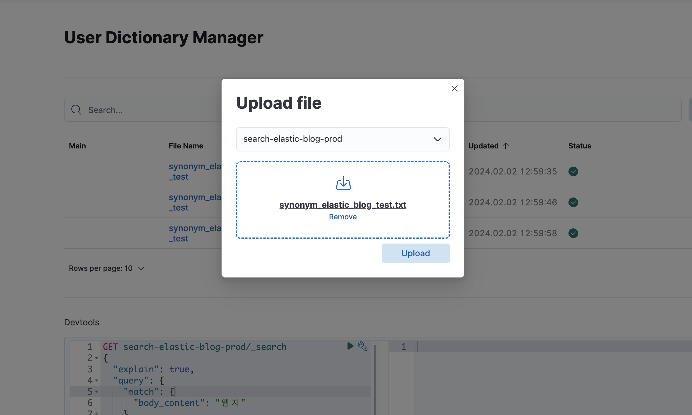
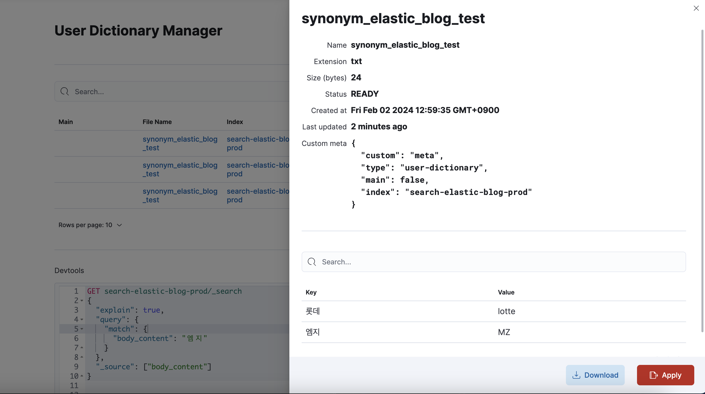

# 엘라스틱 사용자 사전 관리 플러그인

사용자 사전 등록, 버전 관리 등 기능을 제공합니다.

## 사전 요구사항

- 키바나가 설치된 시스템
- Git (소스 코드 다운로드 시 필요)

## 설치

1. **플러그인 다운로드**
   Git을 사용하여 플러그인 소스 코드를 다운로드합니다.

   git clone <플러그인 Git 저장소 URL>
   cd <플러그인 디렉토리>

2. **플러그인 설치**

    $ bin/kibana-plugin install file:///local/path/to/<플러그인 파일명>

3. **플러그인 삭제**

    $ bin/kibana-plugin remove userDictionary

참고 : https://www.elastic.co/guide/en/kibana/current/kibana-plugins.html

## 사용

1. **사전 관리 이동**

    사이드바 메뉴에 User Dictionary 바로가기 메뉴를 선택합니다.

    

2. **SSH 구성 설정**

    플러그인 메뉴에서 'Configuration' 선택 후 
    키바나 서버에서 접근될 엘라스틱서치 서버에 SSH 연결 정보를 입력합니다.

    

3. **사전 파일 업로드**

    플러그인 메뉴에서 'User Dictionary' 선택 후 
    'Upload File' 버튼을 클릭해 사용자 사전 파일과 적용시킬 대상 인덱스를 선택 후 업로드 합니다.

    

4. **사전 파일 적용**

    업로드된 파일 리스트에서 적용시킬 사전을 선택한 후 'Apply' 버튼을 클릭해 활성화 시킵니다.
    Apply 버튼 클릭시 연결된 엘라스틱서치 호스트 정보를 불러와 
    디렉토리 위치에 파일을 전송후 인덱스 업데이트 처리하게 됩니다.

    